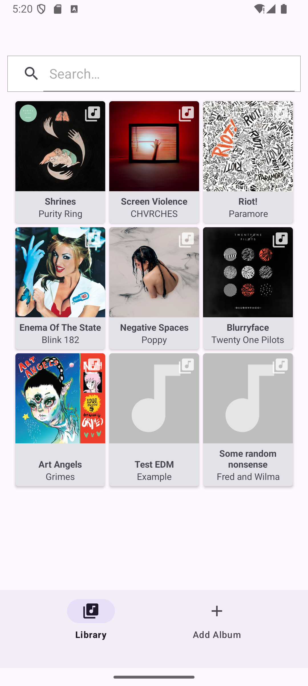
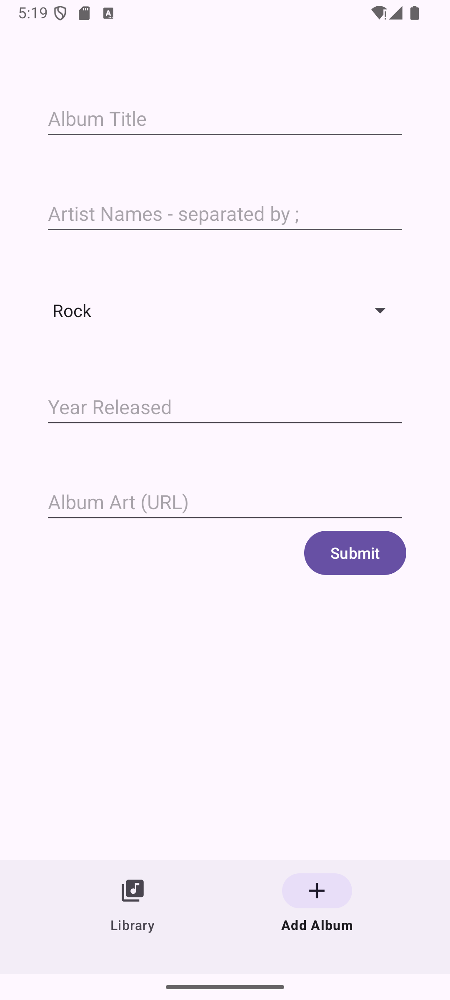

# The Album Store

This Album Store Android demo app provides a frontend UI for the [Album Store API] backend.

## Technology used

- Java
- Android
- Views
- Retrofit
- Glide

## Features

- Album info is fetched from the backend via a RESTful API
- Album art is displayed together with metadata
- Clicking on an album opens an "edit" or "update" form
- New albums can be added using a similar form

## Screenshots

## TODO

- Refresh album data
- Fetch album art from a third-party API
- Fetch artist info from the backend
- Assign existing artists to albums

## Issues

The biggest issue is that adding/updating an album will always _create_ new Artist records in the backend database.
The backend supports re-using an existing artist by its ID, but the frontend does not provide a way to do this yet.

Neither the frontend or the backend have any support for authentication or authorisation. Anyone can add, update, or remove albums.

[Album Store API]: https://github.com/MattSturgeon/spring-album-store-api